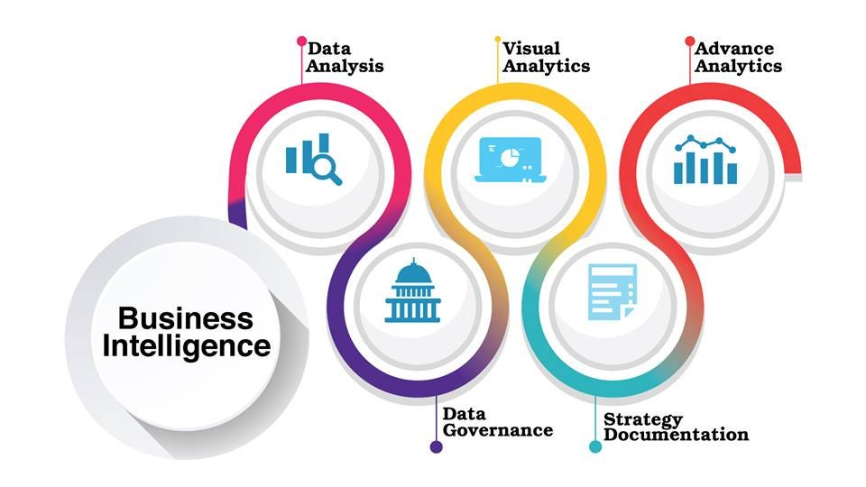

# data-warehousing-and-business-intelligence

		Where do you store a petabyte of
		data for  business intelligence?
		A  data warehouse, that’s where.

	OMIS-113: Data Warehousing and Business Intelligence
	----------------------------------------------------
	This course examines a broad collection  of software 
	tools  and   analytical   applications  that   allow  
	enterprises  to  analyze  data  maintained  in  data   
	warehouses  and  operational databases  for business 
	intelligence. 
	
	Topics  include  data storage  and data  integration 
	architecture,  enterprise  analytics,  and  business 
	intelligence tools and presentations.  Students will 
	acquire hands-on  experience  in  building  business 
	intelligence applications.

