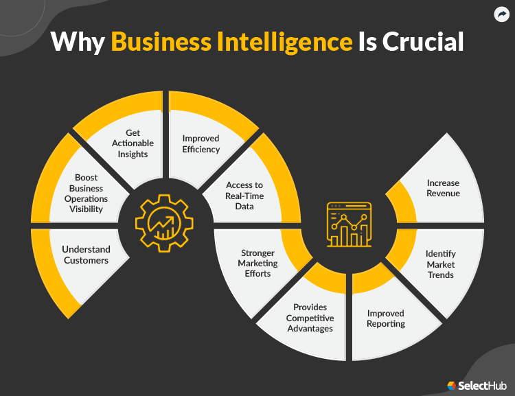

# Business Intelligence

## Overview of Business Intelligence

* BI is revolutionizing decision making and
information technology across all industries. 

* The BI phenomenon is largely due to the 
  ever-increasing availability of data.

* The explosive volumes of data are available in
both structured and unstructured formats, and
are analyzed and processed to become
information within context hence providing
relevance, and purpose to the decision making
process.

## What is Business Intelligence?

* BI is a content-free expression, so it means
different things to different people.

* BI is neither a product, nor a service

* BI refers to people, processes, technologies and
practices used to support business decision
making.

* BI is an umbrella term that combines
architectures, technology, analytical tools,
applications, and methodologies to help
transform data, to information, to knowledge,
to decisions, and finally to action

## Core Functions of BI

* Core functions include query, reporting, and
analysis. Dashboards and other visualization
techniques help users quickly understand
analysis results.

* All of these capabilities require integrated
business data from across the organization. 

## BI and Data

Business Intelligence is the process of:

* analyzing large amounts of data, usually stored 
in large databases such as an Enterprise Data Warehouse,

* Tracking business performance,

* Detecting patterns and trends, and

* Helping enterprise business users make better decisions.

## References

1. [BUSINESS INTELLIGENCE by Solomon Negash ](./Business_Intelligence_by_Solomon_Negash_20_pages.pdf)

2. [An Architecture for a Business and Information System](./An_Architecture_for_a_Business_and_Information_System_21_pages.pdf)

3. [SQL for Business Intelligence by LinkedIn](./SQL_for_Business_Intelligence_LinkedIn.md)

4. [Business Intelligence: A Discussion on Platforms, Technologies, and solutions Tutorial](https://www.rcis-conf.com/rcis2013/document/TUTO/Tutorial_6-Slides.pdf)