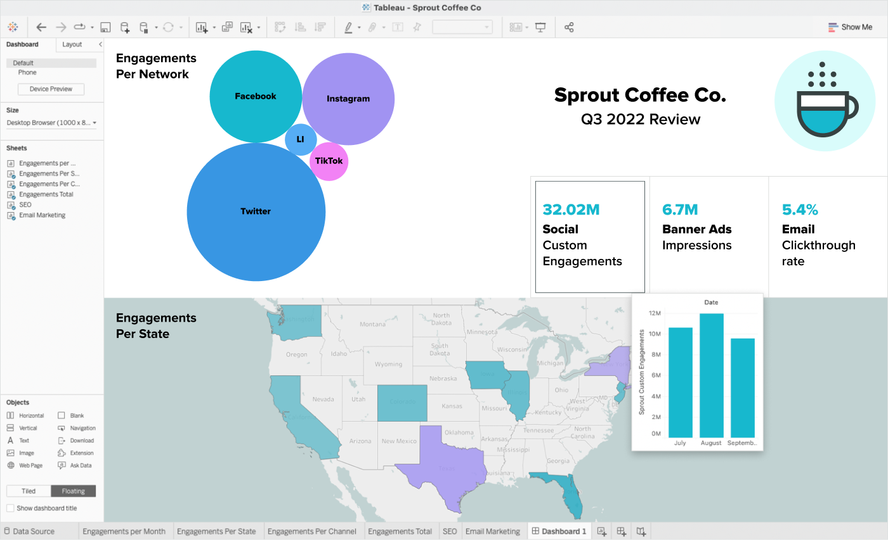

# What is Tableau?

* Tableau is a data analysis and  visualization tool
  that enables users to connect, visualize and share
  data in an  easy-to-understand and meaningful way.
  Its user interface  is generally regarded as  more
  intuitive, with drag-and-drop functionality.
	

* [Tableau](https://www.tableau.com/)is a software 
  company that offers collaborative data visualization 
  software for organizations working with business 
  information analytics. 

* Organizations use Tableau to visualize data and 
  reveal patterns for analysis in business intelligence, 
  making the data more understandable.

* Tableau is a visual analytics platform transforming 
  the way we use data to solve problems—empowering people 
  and organizations to make the most of their data.

